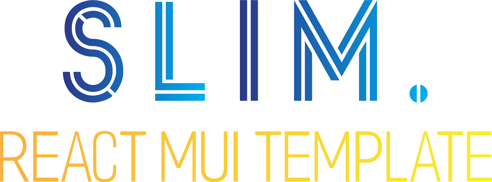

# slim-mui-template &middot;   

<a href="https://github.com/Tono2007/slim-free-react-mui-template?style=social/issues">
  
</a>
<a href="https://github.com/Tono2007/slim-free-react-mui-template/graphs/contributors">
  
</a>


<div align="center">
  
</div>
<h3 align="justify">Modern and clean mui Template

Slim - a free and open source React dashboard template made using the Material UI React component library with aim of flexibility and better customizability.

Modern & Clean Responsive MUI Material-ui Admin Dashboard Template. Using flat and minimal design. It is fully responsive.

It can be used for most type of dashboard and app templates like analytics, admin or messenger app for your desktop or mobile applications. Amazing flexibility and reusability. **85+** Demo pages </h3>

<div align="center">
  
</div>

⭐ ⭐ ⭐ Do not forget to star (Top right of this page) it if you like the theme ⭐ ⭐ ⭐

-   Support React18.
-   Professional user interface.
-   Material UI React components.
-   Fully responsive, all modern browser supported.
-   Easy to use code & folder structure.
-   Flexible & high-Performance code
-   Hundreds of customized MUI components.
-   Pre-build useful pages & Apps.
-   Dark & light mode

## Free SLIM MUI React js version

-   [Preview](https://slim-free-react-mui-template.netlify.app/)
-   [Download from Github](https://github.com/Tono2007/slim-free-react-mui-template)

## Getting Started

Clone from Github

```
git clone https://github.com/Tono2007/slim-free-react-mui-template.git
```

## Technology Stack

-   [Material UI V5](https://mui.com/)
-   React 18
-   Built with React Hooks API
-   Redux & React Context API for State Management
-   React Router for Navigation Routing
-   Vite
-   Code Splitting
-   Aliases
-   Light/Dark theme support
-   Eslint - airbnb style guide


## Issues

### Routing

To report a bug, please submit an [issue](https://github.com/Tono2007/slim-free-react-mui-template/issues) on Github. We will respond as soon as possible to resolve the issue.

### Color Presets

We use different colors

|  |  |  |  |  |
| -------------------------------------------------------- | -------------------------------------------------------- | -------------------------------------------------------- | -------------------------------------------------------- | -------------------------------------------------------- |

### Changelog

<!-- https://ascii-tree-generator.com/ -->

## Folder Structure

```bash
├── package.json           -> Package json file.
├── public
├── README.md
├── src
│   ├── _mocks             -> Mock Json data to be used for working apps
│   ├── assets
│   │   ├── images
│   │   ├── css            -> Template css files
│   │       ├── style.css  -> Application main css file
│   ├── components
│   │   │── layouts
│   │       ├── LandingLayout  -> Layout for landing components & routers
│   │       ├── MainLayout     -> Layout for main components & routers
│   │       ├── MinimalLayout  -> Layout for mimimal components & routers
│   │   ├── loader
│   │   ├── modal
│   │── pages              -> View files for all pages
│   ├── contexts/redux     -> State management
│   ├── utils
│   │   ├── helpers        -> helpers utilities
│   │   ├── hocs           -> Custom hocs
│   │   ├── hooks          -> Custom hooks
│   │   ├── routes         -> router
│   │   ├── theme          -> custom theme provider
│   │   ├── constants      -> general app constants
│   ├──App.js              -> starting point of application
├── vite.config.js         -> Template constant value and live customization
├── index.html
```

## DOC

Slim routing system is based on [react-router](https://reacttraining.com/react-router) and its package [react-router-dom](https://reactrouter.com/en/main), it's also using code splitting for better performance.

## License

-   Licensed cover under [MIT](https://github.com/codedthemes/datta-able-bootstrap-dashboard/blob/master/LICENSE)
